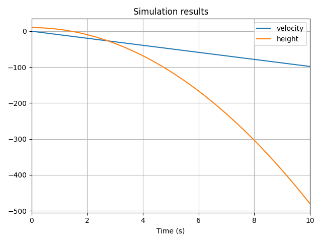

# Debug

## Plotting Evolution over Time

To easily plot a Temporal Variable once the system is solved, called its `.to_plot()` method:


```python
# Create the system
acceleration = vip.temporal(-9.81)
velocity = vip.integrate(acceleration, x0=0)
height = vip.integrate(velocity, x0=10)

# highlight-start
velocity.to_plot()
height.to_plot()
# highlight-end

vip.solve(10)
```

