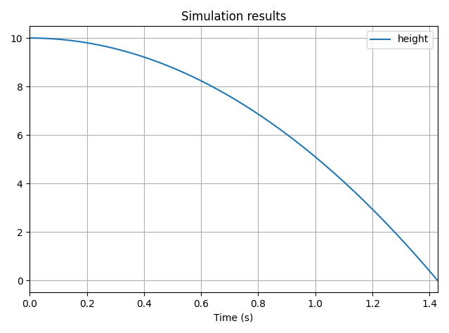

# Events

## Definition

**An event is a condition that triggers an action**.  
Take a bouncing ball: the action is the bouncing, which revert the vertical velocity of the ball. The condition is that the ball touch the ground.

Let's suppose the ground is at $h=0$. Here is how the event solver works:
1. The vertical position of the ball $y_{ball}$ start obviously above the ground.
2. The solver will check at every time step if $y_{ball}\le 0$.
3. When this happens, the solver goes back in time to find the exact time $t_e$ at which $y_{ball}=0$.
4. The action is applied at $t_e$. In our case, we reverse the vertical velocity with a damping factor, i.e. $\dot{y}(t_e)\leftarrow -k.\dot{y}(t_e)$
5. If the event is not terminal, the solver continues integrating from $t_e$.

## Creating Events
### Crossing Events
Because `vip-ivp` only supports continuous variables for the moment, the only available kind of event condition is **crossing detection**.

To create an event, use the `.on_crossing(value, action=None, direction="both", terminal=False)` method of `TemporalVar` instances.

Let's create an event that triggers when a falling object touches the ground:

```python
# Create the system
acceleration = vip.temporal(-9.81)
velocity = vip.integrate(acceleration, x0=0)
height = vip.integrate(velocity, x0=10)

# Create the event
hit_ground = height.on_crossing(0, action=None)

vip.solve(10, time_step=0.01)

# Print the time at which the event occured
print(hit_ground.t_events)
```

The solver detects the exact time at which `height` crossed 0. Because the `hit_ground` event has no action, it does nothing.  
However, time at which the event occured is added to its `t_events` attribute.

### Crossing Direction

The `direction` argument let you define the direction of the crossing that triggers the event. It takes the following values:
- `"rising"`: when the crossing happens from below
- `"falling"`: when the crossing happens from the top
- `"both"` (default): when the crossing happens, regardless of the direction.

### Terminal events

If `terminal=True`, the simulation ends when the events occurs.

In the previous example, our falling object continued its course below the ground. Let's fix that:

```python
# Create the system
acceleration = vip.temporal(-9.81)
velocity = vip.integrate(acceleration, x0=0)
height = vip.integrate(velocity, x0=10)

# Create the event
hit_ground = height.on_crossing(0, action=None, terminal=True)

height.to_plot()

vip.solve(10, time_step=0.01)
```


## Actions
**An action is a function with only side-effects** that is executed at the time an event is triggered.

There exists two kinds of actions:
1. System actions: they can modify the state of the system during the simulation
2. Custom actions: trigger any function when an event occurs. However, do not try to modify the system with them.

### Custom actions
The user can create custom actions from functions with side-effects. However, **custom actions are not adapted to modify the simulation**. Use them for post-processing purpose.

In the `.on_crossing()` method, fill the `action` argument with an user-defined function:

```python
# Create the system
acceleration = vip.temporal(-9.81)
velocity = vip.integrate(acceleration, x0=0)
height = vip.integrate(velocity, x0=10)

# Create events
height.on_crossing(0, action=lambda: print("Hello"))
height.on_crossing(-1, action=lambda: print("world"))

vip.solve(10, time_step=0.01)
```

The console prints:
```
Hello
world
```

Custom functions can get **a time argument that will get the time $t_e$** at which the event occurs. Let's use it to print the time at which the crossing occurs:

```python
def print_collision_time(t):
    print(f"Collision at {t}.")


# Create the system
acceleration = vip.temporal(-9.81)
velocity = vip.integrate(acceleration, x0=0)
height = vip.integrate(velocity, x0=10)

# Create events
height.on_crossing(0, action=print_collision_time)

vip.solve(10, time_step=0.01)
```

The console prints:

```
Collision at 1.4278431229270645.
```

### System actions
#### Reset the value of an Integrated Variable

#### Modify the behavior of a Temporal Variable

### Compose actions