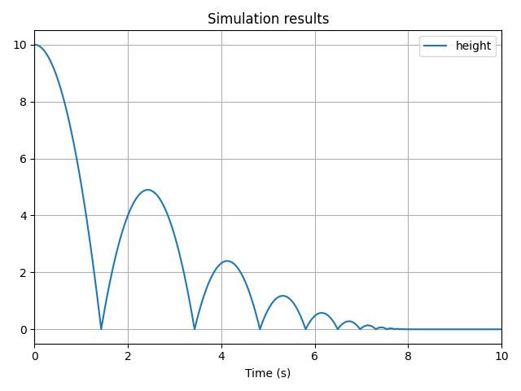

# Events

## What is an Event?

**An event is a condition that triggers an action.**  
Consider a bouncing ball: the action is the bounce (reversing the ball's velocity), and the condition is that the ball hits the ground.

Suppose the ground is at $h = 0$. Here is how the event solver works:

1. The ball's vertical position $y_{ball}$ starts above the ground.
2. At each time step, the solver checks whether $y_{ball} \leq 0$.
3. When this occurs, the solver rolls back in time to locate the exact event time $t_e$ when $y_{ball} = 0$.
4. The action is applied at $t_e$. In this case: $\dot{y}(t_e) \leftarrow -k \cdot \dot{y}(t_e)$.
5. If the event is not terminal, the solver continues integrating from $t_e$.

## Creating Events

### Crossing Events

Currently, `vip-ivp` supports **crossing detection** as the only event type (only continuous variables can trigger events).

To define a crossing event, use `.on_crossing(value, action=None, direction="both", terminal=False)` on a `TemporalVar`.

Example: detect when a falling object hits the ground.

```python
acceleration = vip.temporal(-9.81)
velocity = vip.integrate(acceleration, x0=0)
height = vip.integrate(velocity, x0=10)

# Create a crossing event
hit_ground = height.on_crossing(0)

vip.solve(10, time_step=0.01)

print(hit_ground.t_events)  # Time(s) when event occurred
```

Even if the event has no action, `hit_ground.t_events` records the trigger times.

### Crossing Direction

Use the `direction` argument to filter event triggers:

- `"rising"`: triggered when the value crosses the threshold from below
- `"falling"`: triggered when crossing from above
- `"both"` _(default)_: triggered regardless of crossing direction

### Terminal Events

Set `terminal=True` to stop the simulation when the event triggers.

```python
acceleration = vip.temporal(-9.81)
velocity = vip.integrate(acceleration, x0=0)
height = vip.integrate(velocity, x0=10)

hit_ground = height.on_crossing(0, terminal=True)

height.to_plot()
vip.solve(10, time_step=0.01)
```


## Time-Based Events

Time-based events are crossing events applied to simulation time.

### Timeout

Use `vip.set_timeout(action, delay)` to apply an action after a given delay.

### Interval

Use `vip.set_interval(action, delay)` to repeat an action periodically.

## Actions

**Actions are side-effect-only functions executed when events trigger.**

There are two types:

1. **System actions**: modify the simulation state
2. **Custom actions**: run arbitrary code (e.g., logging), but **must not modify the simulation**

### Custom Actions

Define a function with side effects:

```python
height.on_crossing(0, action=lambda: print("Hello"))
height.on_crossing(-1, action=lambda: print("world"))
```

**Output:**

```
Hello
world
```

To access the event time, add an argument to the input function:

```python
def log_time(t):
    print(f"Collision at {t}.")

height.on_crossing(0, action=log_time)
```

### System Actions

System actions alter simulation variables. They can only be used with `TemporalVar` or `IntegratedVar`.

#### Resetting an Integrated Variable

Use `.action_reset_to(value)` to instantly change the state:

```python
velocity.action_reset_to(-velocity)  # Reverse velocity
```

#### Changing a Temporal Variable

Use `.action_set_to(new_value)` for non-integrated `TemporalVar`s:

```python
count.action_set_to(count + 1)  # Increment a counter
```

#### Terminate the Simulation

Use `vip.action_terminate` to stop the simulation from within an action.

#### Disable Events

Access `.action_disable` on an event to prevent it from triggering again.

```python
disable_action = my_event.action_disable
```

### Combining Actions

Use `+` to combine multiple actions into a single one. The action on the **left** side of the operator is executed **first**.

```python
action_combo = action1 + action2  # Executes action1, then action2
```

### Conditional Actions

Use `vip.where(condition, action_if_true, action_if_false)`:

```python
bounce = velocity.action_reset_to(-k * velocity)
stop = acceleration.action_set_to(0) + velocity.action_reset_to(0)

conditional = vip.where(abs(velocity) > v_min, bounce, stop)
height.on_crossing(0, conditional)
```


