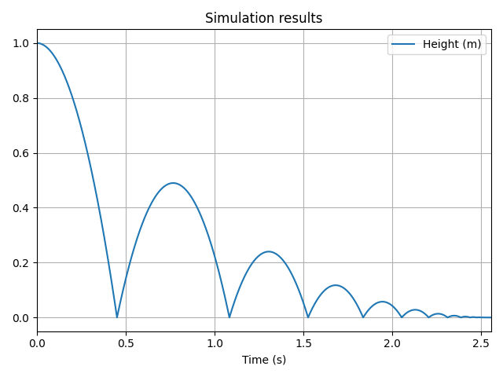

# Overview

**vip-ivp** is a Python package that allows you to **create and simulate dynamical systems** with an elegant script approach. It is a free, code-based alternative to Simulink - each block becomes a line of code, making it a faster way to build systems.

## Quick example

Here is a simple bouncing ball example with event handling:

```python title="bouncing_ball.py"
import vip_ivp as vip

# Parameters
initial_height = 1  # m
GRAVITY = -9.81
k = 0.7  # Bouncing coefficient
v_min = 0.01  # Minimum velocity need to bounce

# Create the system
acceleration = vip.create_source(GRAVITY)
velocity = vip.integrate(acceleration, x0=0)
height = vip.integrate(velocity, x0=initial_height)

# Define bounce action: reverse velocity if it's large enough, else stop
bounce = vip.where(abs(velocity) > v_min, velocity.set_value(-k * velocity), vip.terminate)
# Define the event that triggers bounce when height crosses 0 downward (falling)
height.on_crossing(0, bounce, terminal=False, direction="falling")

# Add variables to the plot
height.to_plot("Height (m)")

# Solve the system
vip.solve(20, time_step=0.001)
```

The following plot opens upon solving:



## Features
