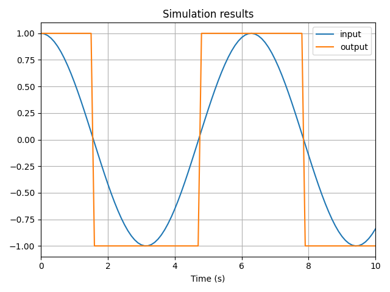
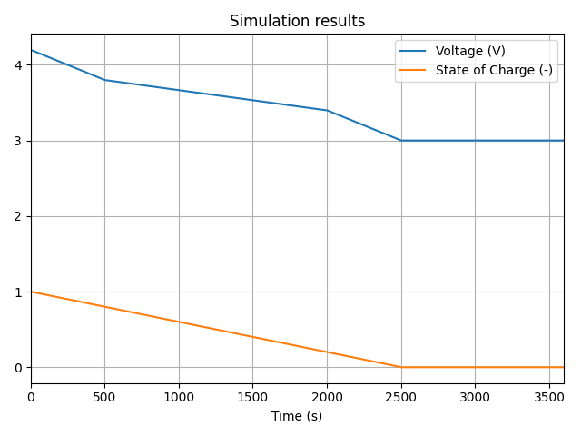
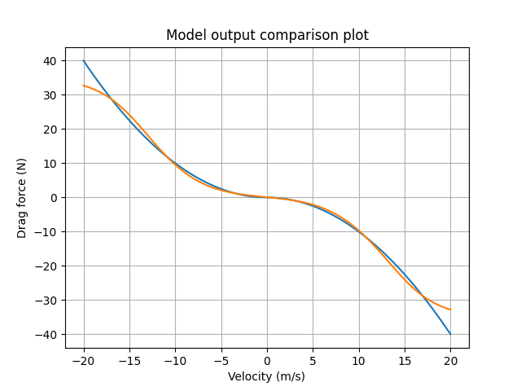
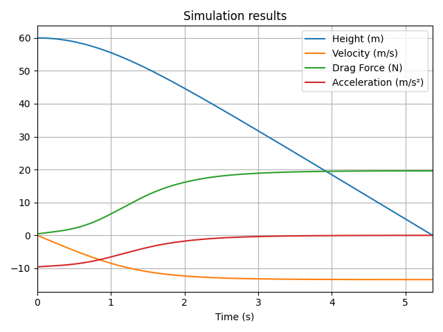

# Applying Functions

One of the best features of `vip-ivp` is the ability to integrate functions from the Python ecosystem like SciPy, PyTorch, or OpenCV into your system.

Since systems are built using `TemporalVar` objects, **we need to adapt third-party functions to work with and return TemporalVar instances**. `vip-ivp` provides straightforward methods to incorporate functions from your favorite libraries into temporal variables.

:::danger
**`TemporalVar` instances must be built from pure functions**. Pure functions have a return value and do not have side-effects.

Using functions with side-effects may cause **unpredictable behavior** in `vip-ivp`.
:::

## Wrapping Functions with `vip.f()`

The `vip.f(fun)` function creates a wrapper that makes any function compatible with Temporal Variables by:

- Accepting `TemporalVar` inputs
- Returning a `TemporalVar` result

For example, by applying `vip.f()` to a function that takes a `float` input and outputs an `int`, you'll get a function that accepts either a `float` or a `TemporalVar[float]` input and outputs a `TemporalVar[int]`:

```python
def basic_function(x: float) -> int:
    if x > 0:
        return 1
    else:
        return -1

input = vip.temporal(lambda t: np.cos(t))
output = vip.f(basic_function)(input)

input.to_plot()
output.to_plot()

vip.solve(10, plot=False)
```



:::info
You might see type-checking warnings in your IDE when calling a function wrapped with `vip.f()`. These warnings can be safely ignored.

This behavior is due to current limitations in Python's `typing` system, which doesn't yet support expressing the correct type signature of functions wrapped by `vip.f()`.

Rest assured — your code is valid and will run correctly.
:::

## Wrapping Methods with `TemporalVar.m()`

The `TemporalVar.m(method)` function, similar to `vip.f()`, makes methods of the instance contained in a `TemporalVar` compatible with Temporal Variables.

Here's an example with a Temporal Variable containing a NumPy array. With `TemporalVar.m()`, you can call the `reshape()` method of the NumPy array object:

```python
array_source = vip.temporal([lambda t: t, lambda t: 2 * t, lambda t: 3 * t, lambda t: 4 * t])
reshaped_array = array_source.m(np.ndarray.reshape)((2, 2))
```

:::tip
Another way to get the method object is to use the `output_type` property:

```python
array_source = vip.temporal([lambda t: t, lambda t: 2 * t, lambda t: 3 * t, lambda t: 4 * t])
# highlight-next-line
reshaped_array = array_source.m(array_source.output_type.reshape)((2, 2))
```
:::

## When Wrapping is Not Needed

A system is composed of `TemporalVar` instances. Since this is a custom class that doesn't contain actual values before solving, many functions aren't compatible out-of-the-box with `TemporalVar` inputs.

When a function isn't compatible, it must be wrapped using `vip.f()`.

Functions are compatible with `TemporalVar` out-of-the-box in only two cases:

1. The function is a NumPy `ufunc` ([List of `ufuncs`](https://numpy.org/doc/stable/reference/ufuncs.html))
2. The function is specifically designed to accept and return `TemporalVar` instances — typically custom functions that you define as part of your system.

For all other functions, you will need wrapping.

## Examples

### Example 1: Apply an Empirical Map with `np.interp()`

Let's apply a map for battery voltage as a function of state of charge (SoC):

```python
import numpy as np

# Data map
voltage_per_soc = {0.0: 3.0, 0.2: 3.4, 0.5: 3.6, 0.8: 3.8, 1.0: 4.2}
# Create input
soc = vip.temporal(lambda t: np.maximum(1.0 - 0.05 * t, 0))
# Create output with np.interp
voltage = vip.f(np.interp)(soc, list(voltage_per_soc.keys()), list(voltage_per_soc.values()))

voltage.to_plot()
soc.to_plot()

vip.solve(30, time_step=0.01)
```
As the state of charge (SoC) decreases, the voltage also drops, following the behavior defined by the map.



### Example 2: Use a Trained Model with PyTorch

In this example, we'll demonstrate how to use a Neural Network as a component in our system.

We'll build a free-falling body simulation with air drag, where the drag will be learned by a neural network.

#### 1. Training the Neural Network for Drag

```python
import torch
import numpy as np
import matplotlib.pyplot as plt

# Ground truth drag function: -0.1 * v * abs(v)
def true_drag(v):
    return -0.1 * v * np.abs(v)

# Training data
v_train = np.linspace(-20, 20, 200).reshape(-1, 1)
drag_train = true_drag(v_train)

# Torch tensors
v_tensor = torch.tensor(v_train, dtype=torch.float32)
drag_tensor = torch.tensor(drag_train, dtype=torch.float32)

class DragModel(torch.nn.Module):
    def __init__(self):
        super().__init__()
        self.net = torch.nn.Sequential(
            torch.nn.Linear(1, 32),
            torch.nn.Tanh(),
            torch.nn.Linear(32, 1)
        )

    def forward(self, x):
        return self.net(x)

model = DragModel()
optimizer = torch.optim.Adam(model.parameters(), lr=0.01)
loss_fn = torch.nn.MSELoss()

# Training loop
for epoch in range(300):
    pred = model(v_tensor)
    loss = loss_fn(pred, drag_tensor)
    optimizer.zero_grad()
    loss.backward()
    optimizer.step()

# Plotting the results of the learning
print(f"Final loss: {loss.item():.4f}")
plt.plot(v_train, drag_train, label="True drag")
with torch.no_grad():
    plt.plot(v_train, model(v_tensor).numpy(), label="Model prediction")
plt.grid()
plt.legend()
plt.show()
```



#### 2. Using the PyTorch Model in the System

With `vip.f()`, we can transform `model` into a function that outputs a `TemporalVar` instance. However, we must ensure type compatibility: if a function expects a `float` argument, only a `TemporalVar[float]` will be compatible.

Since `model(velocity)` takes a `Tensor` input and returns a `Tensor`. Since our velocity input is a TemporalVar[float], we need to handle the conversion between these types.

```python
import vip_ivp as vip

# Set up the system
mass = 2.0
g = -9.81
h0 = 100  # m

acc = vip.loop_node()
v = vip.integrate(acc, x0=0)
y = vip.integrate(v, x0=h0)

# Compute drag with the neural network
# The model needs a Tensor as input, so we convert v to a NumPy array, then a tensor
v_np = vip.f(np.atleast_1d)(v)
v_tensor = vip.f(torch.tensor)(v_np, dtype=torch.float32)
# Use our tensor input in the PyTorch model
drag_tensor = vip.f(model)(v_tensor)
# Convert our drag Tensor to a float
drag = drag_tensor.m(drag_tensor.output_type.item)()

acc.loop_into(g + drag / mass)

# Terminate the simulation when hitting the ground
y.on_crossing(0, direction="falling", terminal=True)

# Plotting
y.to_plot("Height (m)")
v.to_plot("Velocity (m/s)")
drag.to_plot("Drag Force (N)")
acc.to_plot("Acceleration (m/s²)")

vip.solve(100, time_step=0.01)
```

The results align with the expected behavior of a free-fall with air drag. As the velocity increases, the drag force also increases, eventually reaching an equilibrium point where the acceleration becomes zero. After that, the velocity stabilizes and remains constant.



#### Alternative: Create an Adapter Function for the PyTorch Model

A cleaner approach is to create an adapter function that handles all the type conversions. This function accepts and returns `float` types, making it easier to integrate with `vip-ivp`:

```python
def adapt_model(velocity: float, model: torch.nn.Module) -> float:
    v_np = np.atleast_1d(velocity)
    v_tensor = torch.tensor(v_np, dtype=torch.float32)
    result_tensor = model(v_tensor)
    return result_tensor.item()

# Set up the system
acc = vip.loop_node()
v = vip.integrate(acc, x0=0)
y = vip.integrate(v, x0=h0)

# Compute drag with the neural network using our adapter
drag = vip.f(adapt_model)(v, model)

acc.loop_into(g + drag / mass)

# Terminate the simulation when hitting the ground
y.on_crossing(0, direction="falling", terminal=True)

# Plotting
y.to_plot("Height (m)")
v.to_plot("Velocity (m/s)")
drag.to_plot("Drag Force (N)")
acc.to_plot("Acceleration (m/s²)")

vip.solve(100, time_step=0.01)
```