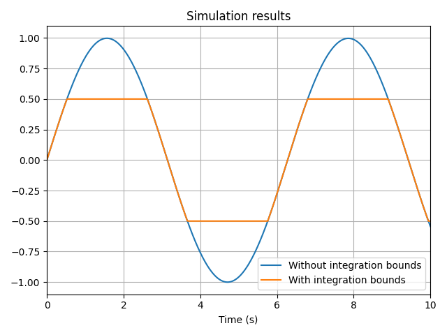
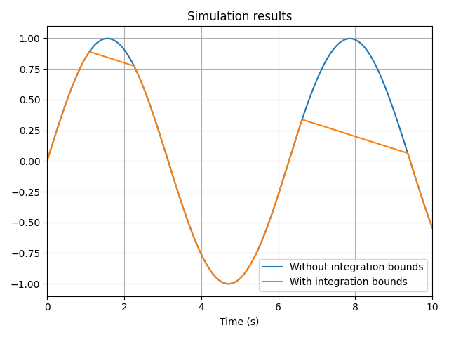

# Integration

To create an integrated variable, use the `vip.integrate(value, x0)` function:

- `value` is the variable to be integrated
- `x0` is the value of the integrated variable at $t=0 s$

```python
# Create a sine by integrating a cosine
cosine = vip.temporal(lambda t: np.cos(t))
sine = vip.integrate(cosine, 0)
```

## Integrate a standard Python value

Standard Python values can be integrated. The only restriction is that it must be a numeric value or a collection containing only numeric values.

If `value` is a collection, `x0` must follow the same structure: it must be a `dict` with matching keys, or a `list`/`ndarray` with the same shape.

```python
integrated_constant = vip.integrate(5, x0=0)
integrated_dict = vip.integrate({"a": 3, "b": lambda t: -t}, x0={"a": 1, "b": 3})
integrated_list = vip.integrate([1, 2, 3], x0=[3, 4, 5])
```

## Integrate a Temporal Variable containing a collection

You can also integrate `TemporalVar` instances that contain collections of numeric values. As with standard collections, `x0` must match the structure of `value`.

```python
source_dict = vip.temporal({"a": 3, "b": lambda t: -t})
source_list = vip.temporal([1, 2, 3])

integrated_dict = vip.integrate(source_dict, x0={"a": 1, "b": 3})
integrated_list = vip.integrate(source_list, x0=[3, 4, 5])
```

## Set output limits

To prevent an integrated variable from exceeding certain values — for example, in a PID controller with anti-windup — use the `minimum` and `maximum` arguments to set bounds on the output.

```python
import numpy as np

source = vip.temporal(lambda t: np.cos(t))
# Variable with output limits
bounded_variable = vip.integrate(source, x0=0.0, maximum=0.5, minimum=-0.5)
# Variable without output limits
unbounded_variable = vip.integrate(source, x0=0.0)

unbounded_variable.to_plot("Without integration bounds")
bounded_variable.to_plot("With integration bounds")

vip.solve(10, time_step=0.01)
```

The following result is obtained:



:::warning
If `x0` lies outside the [`minimum`, `maximum`] bounds, it will raise a `ValueError`.
:::

### Variable bounds

The `minimum` and `maximum` arguments can also be dynamic `TemporalVar` instances:

```python
import numpy as np

source = vip.temporal(lambda t: np.cos(t))
upper_limit = vip.temporal(lambda t: 1 - 0.1 * t)

bounded_variable = vip.integrate(source, x0=0.0, maximum=upper_limit)
unbounded_variable = vip.integrate(source, x0=0.0)

unbounded_variable.to_plot("Without integration bounds")
bounded_variable.to_plot("With integration bounds")

vip.solve(10, time_step=0.01)
```



:::warning
If both `minimum` and `maximum` are set, they must not cross over at any point in time — the `minimum` must always remain less than or equal to the `maximum`. Violating this condition will result in an error.
:::