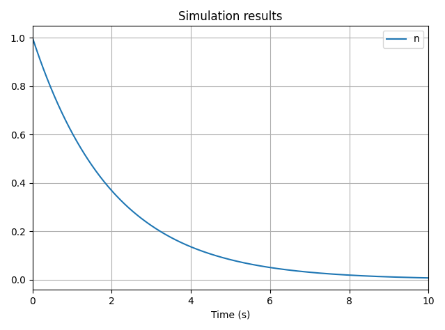
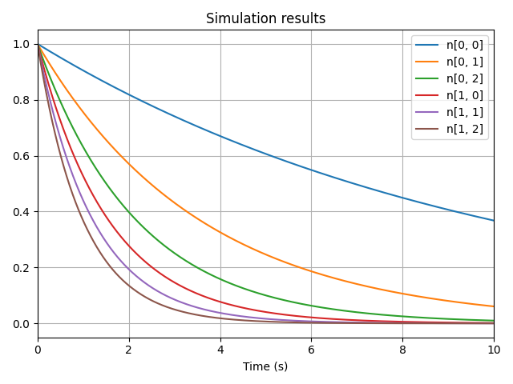
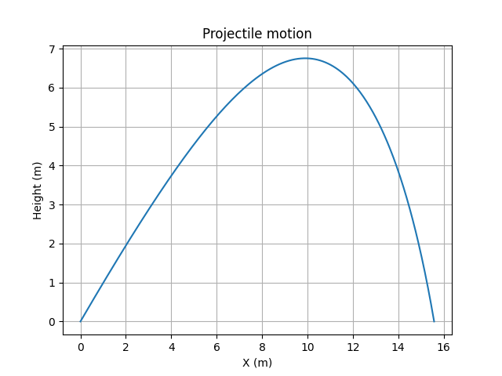

# Loop Nodes

## How to use

Circularity is an inevitable component of dynamical systems. To model such feedback loops while preserving a causal structure, `vip-ivp` provides Loop Nodes.

A Loop Node is a placeholder variable that can be used to define other variables before being assigned a value. This is useful for defining equations where a variable’s derivative depends on the variable itself.

Loop Nodes must always follow the same pattern:

1. Create the highest order derivative using a Loop Node by calling `vip.loop_node()`.
2. Use the created Loop Node to build other dependent variables.
3. Set the Loop Node’s value with `.loop_into(value)` after all necessary variables have been defined.

Here’s a minimal example using the exponential decay ODE: 

$\frac{dN}{dt} = -\lambda N$ :

```python
lambda_value = 0.5
# 1. Create the highest order derivative using a Loop Node
d_n = vip.loop_node()
# 2. Use the loop node to create the integrated variable
n = vip.integrate(d_n, 1)
# 3. Set the loop node's value
d_n.loop_into(-lambda_value * n)

n.to_plot()

vip.solve(10, time_step=0.001)
```


## Loop Nodes containing NumPy Arrays

Loop Nodes can represent scalar or array values. When calling `vip.loop_node()` without arguments, a scalar variable is created. To instantiate a Loop Node with a NumPy array shape, provide the `shape` argument:

```python
# Multidimensional exponential decay:
import numpy as np

# Array of lambda coefficients
lambdas = np.linspace(0, 1, 6).reshape(2, 3)
# Building the system
d_n = vip.loop_node(shape=(2, 3))
n = vip.integrate(d_n, np.zeros((2, 3)))
# Loop into an array of shape (2, 3)
d_n.loop_into(n * lambdas)

n.to_plot()

vip.solve(10, time_step=0.001)
```


This approach is especially useful for modeling vector quantities, such as positions in 2D or 3D space.

### Example: Projectile Motion with Air Drag

```python
import matplotlib.pyplot as plt
import vip_ivp as vip
import numpy as np

# Parameters
GRAVITY = -9.81
v0 = 30
th0 = np.radians(45)
mu = 0.1  # Coefficient of air drag

# Compute initial conditions
v0 = [v0 * np.cos(th0), v0 * np.sin(th0)]
x0 = [0, 0]

# Create the system
acceleration = vip.loop_node(2)
velocity = vip.integrate(acceleration, v0)
position = vip.integrate(velocity, x0)
v_norm = np.sqrt(velocity[0] ** 2 + velocity[1] ** 2)
acceleration.loop_into([-mu * velocity[0] * v_norm,
                        GRAVITY - mu * velocity[1] * v_norm])
# Terminate on touching the ground
position[1].on_crossing(0, direction="falling", terminal=True)

vip.solve(10, time_step=0.01)

# Plot results
x, y = position.values
plt.plot(x, y)
plt.title("Projectile motion")
plt.xlabel("X (m)")
plt.ylabel("Height (m)")
plt.grid()
plt.show()
```



## Safeguards

Loop Nodes can easily be misused. To prevent common mistakes, several safeguards are implemented.

### Enforcing that Loop Nodes Must Be Set

It is easy to forget to set the value of a Loop Node. To avoid silent bugs, an exception is raised during `vip.solve()` if a Loop Node was never set.

To disable this safety check, pass `strict=False` when creating the node:

```python
d_n = vip.loop_node(strict=False)
```

In this case, the Loop Node will behave as if its value is `0` or `np.zeros(shape)`.

### Preventing Multiple `.loop_into()` Calls

A Loop Node can only be set once by default. If you attempt to call `.loop_into()` a second time, an exception is raised.

To override this behavior and **add** the new value to the existing one, use `force=True`:

```python
d_n = vip.loop_node()
n = vip.integrate(d_n, 1)
d_n.loop_into(-0.2 * n)
d_n.loop_into(-0.3 * n, force=True)
```

The value of the second `.loop_into()` will be added.

### Algebraic loops

Algebraic loops occur when a variable directly depends on itself, e.g. `d_n = 2 * d_n`. This causes infinite recursion in Python, resulting in a `RecursionError`.

To avoid this, ensure that any feedback loop includes at least one integration or delay step.

**Example of an algebraic loop (don’t do this):**

```python
d_n = vip.loop_node()
a = 2 * d_n
d_n.loop_into(a)
```
