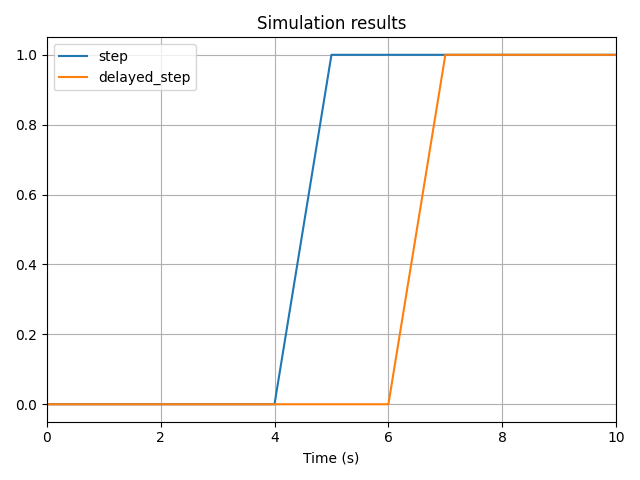

# Using Past Values

:::warning
Use these features with a **small time step**. The solver cannot guarantee high precision for results computed with delayed or differentiated variables.
:::

## Delayed Variables

You can create a delayed copy of a Temporal Variable using the `.delayed(n_steps)` method.

The `n_steps` argument specifies the **number of time steps** (not seconds) by which the variable is delayed.

In the example below, we delay a variable by 2 time steps:

```python
step = vip.temporal(lambda t: 0 if t < 5 else 1)
delayed_step = step.delayed(2)

step.to_plot()
delayed_step.to_plot()

vip.solve(10, time_step=1)
```

Since the simulation uses a time step of 1 second, the delayed variable is effectively shifted by 2 seconds:



:::warning
Delays may not behave as expected when combined with **events**.

When an event is triggered, the solver automatically changes the time step. For example, if your time step is 1s and an event happens at 4.3s, the solver will use intermediate steps at 4s, 4.3s, and 5s. This results in irregular step sizes (e.g., 0.3s before the event and 0.7s after).

To maintain a truly constant time step even in the presence of events, pass `include_events_times=False` to `vip.solve()`.
:::

## Approximate Derivatives

The `.derivative()` method computes an **approximate derivative** of a Temporal Variable using its past values.

Ordinarily, it's not possible to compute derivatives directly with an IVP solver, as it uses numerical integration. However, by accessing past values, we can approximate the derivative using a difference quotient:

$$
\Delta y_n =
\begin{cases}
k_0 & \text{if } n = 0 \\
\displaystyle\frac{y_n - y_{n-1}}{t_n - t_{n-1}} & \text{if } n \geq 1
\end{cases}
$$

Here, $n$ is the current time step and $k_0$ an user-defined initial value.

Because this method relies on past values, the result is **slightly delayed** compared to the true solution:

```python
import numpy as np

sine = vip.temporal(lambda t: np.sin(t))
cosine_true = vip.temporal(lambda t: np.cos(t))
cosine = sine.derivative(initial_value=1)

sine.to_plot()
cosine_true.to_plot()
cosine.to_plot()

vip.solve(10)
```


:::danger
### Integration should always be preferred to differentiation 

Integration provides **accurate** and **stable** results, while differentiation can introduce significant errors.

The following example demonstrates how differentiation may lead to incorrect results:

```python
step = vip.temporal(lambda t: 0 if t < 1 else 1)
# Integrate then differentiate → Just a slight delay
i_step = vip.integrate(step, 0)
step_ok = i_step.derivative()

# Differentiate then integrate → Huge error !!!
d_step_bad = step.derivative()
step_bad = vip.integrate(d_step_bad, 0)

step.to_plot()
step_ok.to_plot()
step_bad.to_plot()

vip.solve(2, time_step=0.01)
```

The output shows a **96% relative error** when differentiating first and then integrating. Differentiation introduces a local error that gets amplified during integration.

In contrast, integrating first and then differentiating only causes a minor delay — because integration preserves numerical stability.


:::
