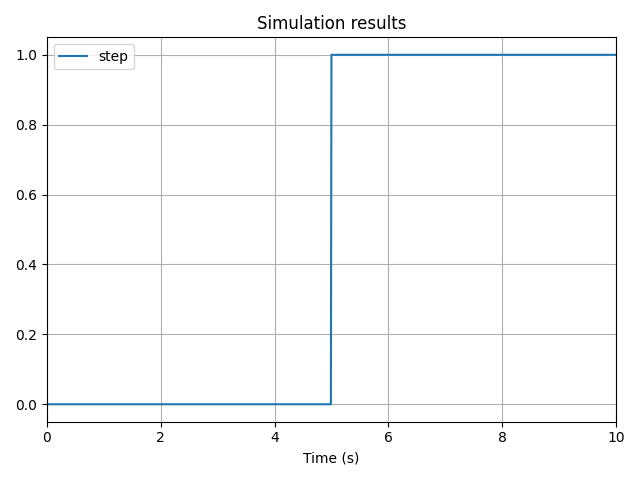

# Conditional Statements

## How to create a conditional statement

Python `if` statements won't work when applied to `TemporalVar` instances. To implement conditional Temporal Variables, use `vip.where(condition, a, b)`.

The expression  `variable = vip.where(condition, a, b)` means that the value of `variable` is `a` at times when the condition is `True`, and `b` otherwise.

## Why `if` doesn't work

`TemporalVar` instances can't behave correctly with regular `if` statements. Using `if` will evaluate the entire `TemporalVar` object as a boolean, which ignores its temporal nature. Because it is ambiguous, a `ValueError` is raised when an `if` is applied to a `TemporalVar`.

To illustrate the issue, let's say we want to create the following step function:

$$
f(t) =
\begin{cases}
0 & \text{if } t < 5 \\
1 & \text{if } t \geq 5
\end{cases}
$$

### ❌ Don't do this

:::danger
This code does **not** work:

```python
time = vip.temporal(lambda t: t)
if time < 5:
    step = vip.temporal(0)
else:
    step = vip.temporal(1)

vip.solve(10, time_step=1)
```
:::

### ✅ Do this instead

:::tip
Use `vip.where()` to define the conditional behavior in a single expression:

```python
time = vip.temporal(lambda t: t)
step = vip.where(time < 5, 0, 1)

step.to_plot()

vip.solve(10, time_step=0.01)
```



:::
