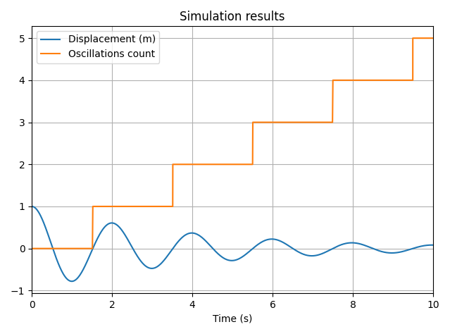
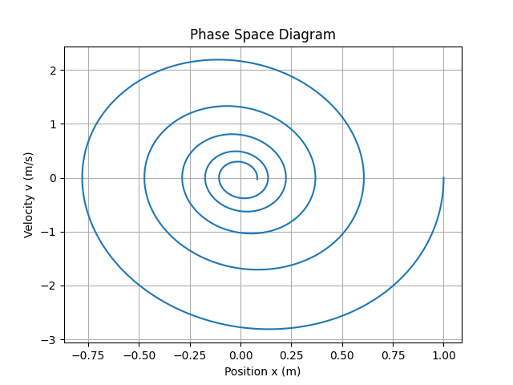

# Tutorial

In this 5-minute tutorial, we will solve the equation of a mass-spring-damper system using `vip-ivp`. Then, we'll demonstrate the event system by counting the number of oscillations.

## Problem Statement

We consider a classic second-order mechanical system: a **mass** attached to a **spring** and a **damper**. The motion of the mass is governed by the differential equation:

$$
m \ddot{x} + c \dot{x} + kx = 0
$$

Where:

- $x$ is the displacement,
- $m$ is the mass,
- $c$ is the damping coefficient,
- $k$ is the spring constant.

We want to:

1. Simulate the motion of the system over time.
2. Count how many times the mass crosses the equilibrium point (i.e., $x = 0$).

## Step-by-step

### 1. Define the parameters

```python
import vip_ivp as vip

m = 1.0     # Mass (kg)
k = 10.0    # Spring constant (N/m)
c = 0.5     # Damping coefficient (N·s/m)

x0 = 1.0    # Initial position (m)
v0 = 0.0    # Initial velocity (m/s)
```

### 2. Build the system

Ordinary Differential Equations are inherently circular, as higher-order derivatives depend on variables that are themselves computed by integrating those derivatives. To manage this circular dependency, `vip-ivp` introduces the `loop_node()` function. A Loop Node acts as a placeholder for a variable whose definition will be completed later

To solve an ODE, follow these steps:

1. **Create a loop node** for the highest-order derivative of the equation. In our case: the acceleration $\ddot{x}$.
2. **Integrate to obtain lower-order derivatives**. In our case: the velocity $\dot{x}$ and displacement $x$.
3. **Loop into the equation**. In our case, $\ddot{x} =-\frac{1}{m}( c \dot{x} + kx)$.

```python
a = vip.loop_node()  # Acceleration
v = vip.integrate(a, v0)  # Velocity
x = vip.integrate(v, x0)  # Displacement
a.loop_into(-(c * v + k * x) / m) # Set acceleration value
```

### 3. Add an event

An **event** is a condition that triggers a specific **action** during the simulation. In the context of dynamical systems, the condition typically involves a variable **crossing a threshold** — for example, when a position variable crosses zero.

To define an event, use the `.on_crossing()` method. You can specify the crossing **direction** with one of:

- `"rising"` – when the variable crosses upward (e.g., from negative to positive),
- `"falling"` – when it crosses downward,
- `"both"` – triggers in either direction.

An **event action** is a side-effect function that will be executed when the event is triggered. To modify the value of a variable upon triggering, use `.action_set_to(new_value)`.

```python
# Create a variable to count the number of oscillations
count = vip.create_source(0)
# Create event that triggers when x crosses 0 (from negative to positive)
x.on_crossing(0, count.action_set_to(count + 1), direction="rising")
```

This allows you to monitor and respond to specific behaviors in the system, such as counting oscillations, handling impacts, or stopping simulations.

### 4. Plot and solve

For quick visualization, variables can be marked for plotting using the `.to_plot()` method. When `vip.solve()` is called, all variables marked this way will be displayed in an automatically generated plot.

You can assign a label to each curve by passing a string to `.to_plot()` — this will be used as the legend in the plot.

```python
# Choose results to plot
x.to_plot("Displacement (m)")
count.to_plot("Oscillations count")
# Solve the system
vip.solve(10, time_step=0.01)
```

After solving, a plot window will open showing the selected variables over time.



### 5. Post-processing

After the system has been solved, you can access the simulation results directly from the variables.

#### Accessing variable values

Each variable has a `.values` property, which returns a NumPy array of its value over time. All variables also have a `.t` property, which holds the corresponding time values.

This makes it easy to use your favorite Python libraries (like `matplotlib`, `plotly`, or `pandas`) for advanced analysis or custom plotting.

Here’s an example that creates a **phase space diagram** (position vs. velocity):

```python
import matplotlib.pyplot as plt

# Create a phase space diagram
plt.plot(x.values, v.values)
plt.xlabel('Position x (m)')
plt.ylabel('Velocity v (m/s)')
plt.title('Phase Space Diagram')
plt.grid()
plt.show()
```



You’re free to combine vip-ivp with any Python tool for post-processing, making it a powerful and flexible option for simulation workflows.

#### Exporting the results

`vip-ivp` provides utilities to easily export simulation results for further analysis or storage.

- Use `vip.export_to_df()` to export one or more variables to a Pandas `DataFrame`.
- Use `vip.export_to_file()` to export directly to a CSV file.

Here’s an example that exports all the temporal variables to a DataFrame:

```python
# Export the results to pandas
dataframe = vip.export_to_df()
print(dataframe)
```

The console prints the following results:

```
      Time (s)          a         v         x  count
0         0.00 -10.000000  0.000000  1.000000      0
1         0.01  -9.945142 -0.099734  0.999501      0
2         0.02  -9.880637 -0.198871  0.998007      0
3         0.03  -9.806599 -0.297316  0.995526      0
4         0.04  -9.723149 -0.394974  0.992064      0
...        ...        ...       ...       ...    ...
1001      9.96  -0.826936  0.003280  0.082530      5
1002      9.97  -0.822709 -0.004971  0.082519      5
1003      9.98  -0.817684 -0.013175  0.082427      5
1004      9.99  -0.811874 -0.021324  0.082254      5
1005     10.00  -0.805290 -0.029411  0.082000      5

[1006 rows x 5 columns]
```

Each row of the DataFrame corresponds to a time step, and columns include the time and the values of the selected variables.

You may notice that the number of rows is slightly higher than expected. For instance, if you simulate for 10 seconds with a time step of 0.01s, you might expect 1001 values — but the DataFrame shows 1006.

This is because `vip-ivp` automatically adds the **exact times at which events occur**, even if they fall between regular time steps. In the example, 5 crossing events were detected and added to the timeline, bringing the total to 1006.

If you prefer to keep a uniform time grid and **exclude event times**, you can pass the following option to `solve()`:

```python
vip.solve(10, time_step=0.01, include_events_times=False)
```

## Complete example

```python
import vip_ivp as vip
import matplotlib.pyplot as plt

# System parameters
m = 1.0  # Mass (kg)
k = 10.0  # Spring constant (N/m)
c = 0.5  # Damping coefficient (N·s/m)

x0 = 1.0  # Initial position (m)
v0 = 0.0  # Initial velocity (m/s)

# Build the system
a = vip.loop_node()  # Acceleration
v = vip.integrate(a, v0)  # Velocity
x = vip.integrate(v, x0)  # Displacement
a.loop_into(-(c * v + k * x) / m)  # Set acceleration value

# Create a variable to count the number of oscillations
count = vip.create_source(0)
# Create event that triggers when x crosses 0 (from negative to positive)
x.on_crossing(0, count.action_set_to(count + 1), direction="rising")

# Choose results to plot
x.to_plot("Displacement (m)")
count.to_plot("Oscillations count")
# Solve the system
vip.solve(10, time_step=0.01)

# Create a phase space diagram
plt.plot(x.values, v.values)
plt.xlabel('Position x (m)')
plt.ylabel('Velocity v (m/s)')
plt.title('Phase Space Diagram')
plt.grid()
plt.show()

# Export the results to pandas
dataframe = vip.export_to_df(v, x)
print(dataframe)
```
